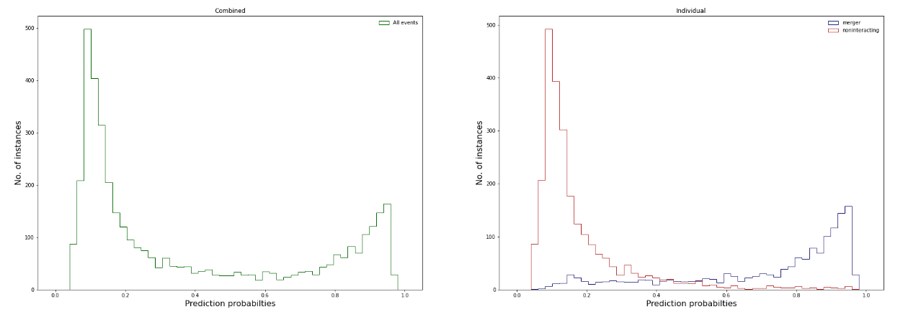

# FFT

**Data**
- `data_spectrum.npy` contains the 1D Power Spectrums of the galaxy images. The last column is the image label, where 0 means non-interacting and 1 means merger.
- Each image was resized to size 100X100 and there are 72 coefficients for each image.

**Results**
- The 1D power spectrums were normalized and used as features for classification. The best test set accuracy achieved was 73.125% using ```"learning_rate": 0.01, "n_estimators": 1000, "reg_lambda": 1e-04, "max_depth": 12```.

- The file `Simple+FFT+PCA.ipynb` applies several related techniques in one notebook. The best accuracy was obtained by using the classifier from `XGBoost` on the flattened images directly, without any PCA or FFT analysis.
- The notebook `SMOTE.ipynb` uses SMOTE resampling to oversample the merger class and undersamples the non-interacting instances to generate a balanced dataset. The default `k_neighbors` value of 5 gave the best performance whereas increasing the `k` value didn't improve the performance.


**Calculation of FFT features**

The real and imaginary parts of the 2D FFT of the images were column stacked to generate the input FFT features for classification.


**Prediction Probabilities (from the best model in this directory)**

