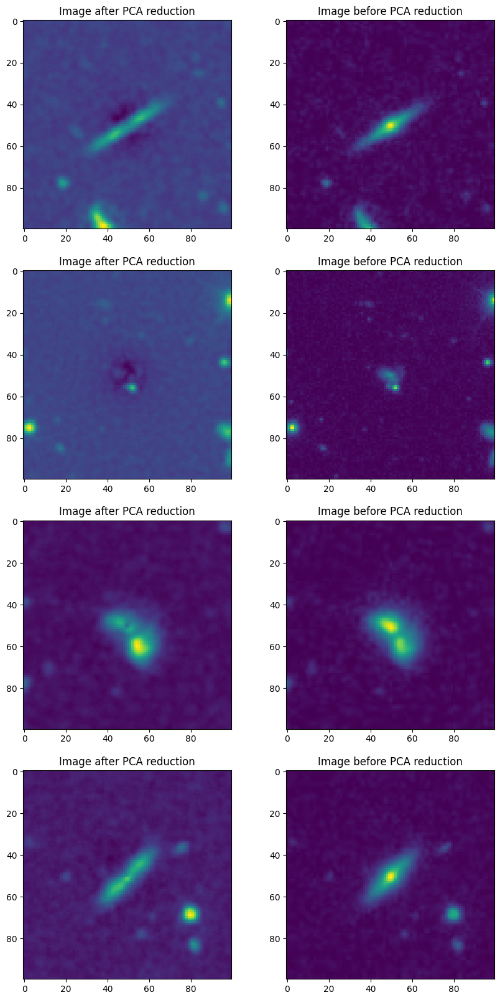

# Principal Component Analysis (PCA)

This section contains the analysis after applying PCA on the dataset. An `XGBoost` classifier was trained on the PCA components.

**Preprocessing**

- The images varied in size and all were resized to 100 X 100 giving a total of 10000 features for each image.
- Using PCA, the number of components chosen was 1024 out of the maximum possible 10000. These 1024 components explained 92.76% variance of the whole dataset.
- It was observed that increasing the no. of components (to explain 99% variance, for example) significantly increased the training time but did not yield gain in classification accuracy.
- The reconstructed images after PCA (using the components) vs the original images in the dataset is shown below:

The files `data_generation.py` and `data_transforms.py` contains some helper functions and the `PCA.ipynb` notebook contains the whole implementation.

**Results**

Accuracy on the test set = 86.75%

- The binary file `flattened_data.npy` (from the notebook) can be found [here](https://drive.google.com/file/d/1_qzSJy11tkK7wPTOsHM1WV1ket2KJRyE/view?usp=sharing)
